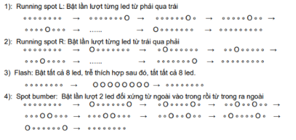
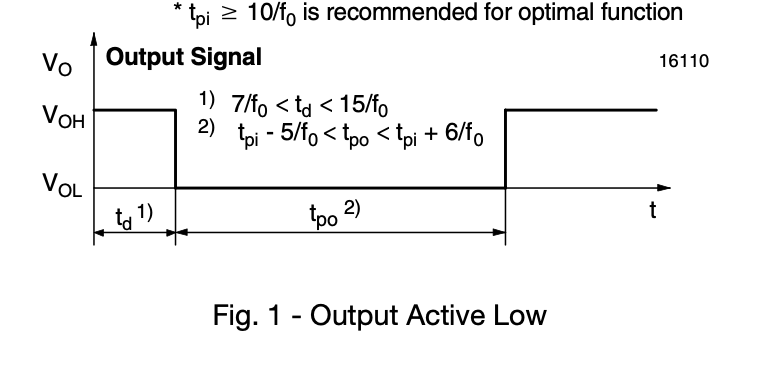
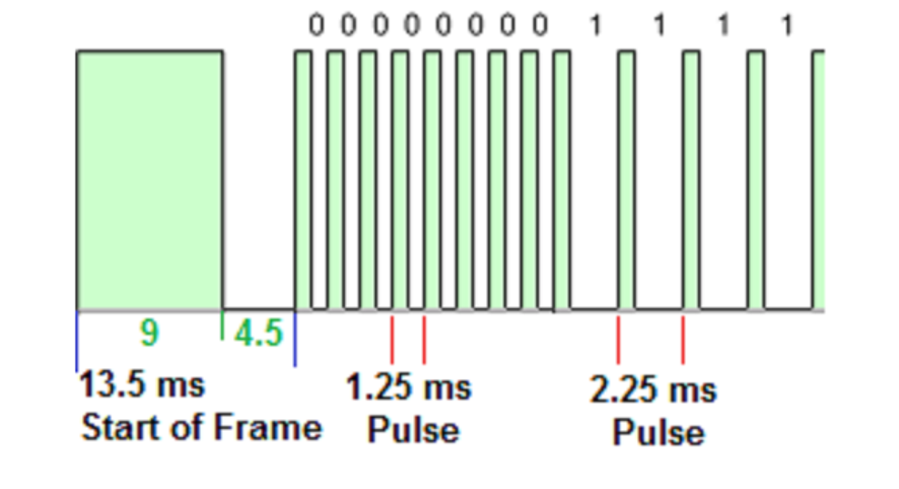
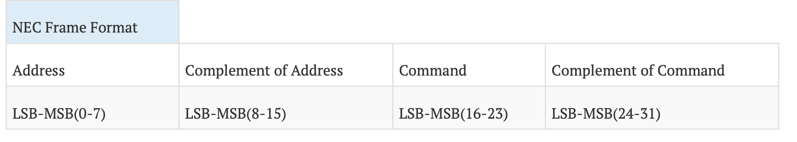

# Embedded Systems Lab 01 Report
Họ và tên: Lê Ngọc Quang Hưng\
MSSV: 20225975

*Cam kết: Nội dung và mã nguồn trong báo cáo thực hành này là do tôi và bạn Nguyễn Thị Thu Huyền cùng tự làm. Bất cứ nội dung nào tham khảo từ bên ngoài thì sẽ được nêu rõ nguồn gốc và tác giả.*


## Nội dung báo cáo
- [Bài 3.1](#bài-31)
- [Bài 3.2](#bài-32)
- [Bài 3.3](#bài-33)
- [Bài 3.4](#bài-34)


## Bài 3.1
Đây là bài tập để điều khiển dãy đèn LED theo các mode khác nhau như hình minh hoạ:


Mã nguồn gốc:
```c
unsigned char LED_Value;
void DisplayLEDs(int mode)
{
  if (mode == 1)
  {
    LED_Value = (LED_Value >> 1) | (LED_Value << 7);
  }

  if (LED_Value & 0x80)
    HAL_GPIO_WritePin(GPIOB, GPIO_PIN_12, GPIO_PIN_SET);
  else
    HAL_GPIO_WritePin(GPIOB, GPIO_PIN_12, GPIO_PIN_RESET);

  if (LED_Value & 0x40)
    HAL_GPIO_WritePin(GPIOB, GPIO_PIN_13, GPIO_PIN_SET);
  else
    HAL_GPIO_WritePin(GPIOB, GPIO_PIN_13, GPIO_PIN_RESET);

  if (LED_Value & 0x20)
    HAL_GPIO_WritePin(GPIOB, GPIO_PIN_14, GPIO_PIN_SET);
  else
    HAL_GPIO_WritePin(GPIOB, GPIO_PIN_14, GPIO_PIN_RESET);

  if (LED_Value & 0x10)
    HAL_GPIO_WritePin(GPIOB, GPIO_PIN_15, GPIO_PIN_SET);
  else
    HAL_GPIO_WritePin(GPIOB, GPIO_PIN_15, GPIO_PIN_RESET);

  if (LED_Value & 0x8)
    HAL_GPIO_WritePin(GPIOA, GPIO_PIN_3, GPIO_PIN_SET);
  else
    HAL_GPIO_WritePin(GPIOA, GPIO_PIN_3, GPIO_PIN_RESET);

  if (LED_Value & 0x4)
    HAL_GPIO_WritePin(GPIOA, GPIO_PIN_4, GPIO_PIN_SET);
  else
    HAL_GPIO_WritePin(GPIOA, GPIO_PIN_4, GPIO_PIN_RESET);

  if (LED_Value & 0x2)
    HAL_GPIO_WritePin(GPIOA, GPIO_PIN_5, GPIO_PIN_SET);
  else
    HAL_GPIO_WritePin(GPIOA, GPIO_PIN_5, GPIO_PIN_RESET);

  if (LED_Value & 0x1)
    HAL_GPIO_WritePin(GPIOA, GPIO_PIN_6, GPIO_PIN_SET);
  else
    HAL_GPIO_WritePin(GPIOA, GPIO_PIN_6, GPIO_PIN_RESET);
}
```

Mã nguồn sau khi sửa:
```c
unsigned char LED_Value; 
// added code
// added code
// added code
unsigned char LED_Values_spot_bumper[] = {0x81, 0x42, 0x24, 0x18, 0x24, 0x42}; 
int current_index = 0; 
// end added code
// end added code
// end added code
void DisplayLEDs(int mode)
{
  if (mode == 1)
  {
    LED_Value = (LED_Value >> 1) | (LED_Value << 7);
  }

  // added code
  // added code
  // added code
  else if (mode == 2)
  {
    LED_Value = (LED_Value << 1) | (LED_Value >> 7);
  }
  else if (mode == 3)
  {
    LED_Value = ~LED_Value;
  }
  else if (mode == 4)
  {
    LED_Value = LED_Values_spot_bumper[current_index];
    current_index++;
    if (current_index >= 6)
    {
      current_index = 0;
    }
  }
  //end added code
  //end added code
  //end added code
  
  if (LED_Value & 0x80)
    HAL_GPIO_WritePin(GPIOB, GPIO_PIN_12, GPIO_PIN_SET);
  else
    HAL_GPIO_WritePin(GPIOB, GPIO_PIN_12, GPIO_PIN_RESET);

  if (LED_Value & 0x40)
    HAL_GPIO_WritePin(GPIOB, GPIO_PIN_13, GPIO_PIN_SET);
  else
    HAL_GPIO_WritePin(GPIOB, GPIO_PIN_13, GPIO_PIN_RESET);

  if (LED_Value & 0x20)
    HAL_GPIO_WritePin(GPIOB, GPIO_PIN_14, GPIO_PIN_SET);
  else
    HAL_GPIO_WritePin(GPIOB, GPIO_PIN_14, GPIO_PIN_RESET);

  if (LED_Value & 0x10)
    HAL_GPIO_WritePin(GPIOB, GPIO_PIN_15, GPIO_PIN_SET);
  else
    HAL_GPIO_WritePin(GPIOB, GPIO_PIN_15, GPIO_PIN_RESET);

  if (LED_Value & 0x8)
    HAL_GPIO_WritePin(GPIOA, GPIO_PIN_3, GPIO_PIN_SET);
  else
    HAL_GPIO_WritePin(GPIOA, GPIO_PIN_3, GPIO_PIN_RESET);

  if (LED_Value & 0x4)
    HAL_GPIO_WritePin(GPIOA, GPIO_PIN_4, GPIO_PIN_SET);
  else
    HAL_GPIO_WritePin(GPIOA, GPIO_PIN_4, GPIO_PIN_RESET);

  if (LED_Value & 0x2)
    HAL_GPIO_WritePin(GPIOA, GPIO_PIN_5, GPIO_PIN_SET);
  else
    HAL_GPIO_WritePin(GPIOA, GPIO_PIN_5, GPIO_PIN_RESET);

  if (LED_Value & 0x1)
    HAL_GPIO_WritePin(GPIOA, GPIO_PIN_6, GPIO_PIN_SET);
  else
    HAL_GPIO_WritePin(GPIOA, GPIO_PIN_6, GPIO_PIN_RESET);
}
...

int main(void)
{
  ...

  while (1)
  {
    ...
    //added code
    //added code
    //added code
    LED_Value = 1;
    for (int i = 0; i <= 15; i++)
        {
          DisplayLEDs(1);
          HAL_Delay(100);
        }
    LED_Value = 0;
    DisplayLEDs(1);


    LED_Value = 1;
    for (int i = 0; i <= 14; i++)
        {
          DisplayLEDs(2);
          HAL_Delay(100);
        }
    LED_Value = 0;
    DisplayLEDs(1);


    LED_Value = 0xff;
    for (int i = 0; i <= 4; i++)
        {
          DisplayLEDs(3);
          HAL_Delay(100);
        }
    LED_Value = 0;
    DisplayLEDs(1);

    current_index = 0;
    for (int i = 0; i <= 12; i++)
        {
          DisplayLEDs(3);
          HAL_Delay(100);
        }
    LED_Value = 0;
    DisplayLEDs(1);
    //end added code
    //end added code
    //end added code


    ...
  }
}


```
Cơ chế điều khiển LED của hàm `DisplayLEDs` là sử dụng 8 bit giá trị của biến LED_Value để điều khiển LED tương ứng, 1 với bật và 0 với tắt. Phần mã nguồn gốc đã có sẵn ví dụ cho chế độ chạy đèn từ phải qua trái sử dụng cơ chế này. Để có thể chạy các chế độ khác nhau, ta cần thêm vào hàm `DisplayLEDs` các chế độ mới và cập nhật giá trị của biến LED_Value tương ứng với chế độ đó. Trong bài này, ta đã thêm 3 chế độ mới:
- Chế độ 2: chạy đèn từ trái qua phải.

Mã nguồn xử lý chế độ 2:
```c
  else if (mode == 2)
  {
    LED_Value = (LED_Value << 1) | (LED_Value >> 7);
  }
```

Tương tự với mode 1 nhưng ngược lại, ta dịch giá trị bit của LED_Value sang trái 1 đơn vị và thực hiện toán tử OR với giá trị của LED_Value dịch sang phải 7 đơn vị (khi này giá trị của LED_Value chính là giá trị của bit đầu tiên của nó). Kết quả là giá trị của LED_Value sẽ dịch sang trái 1 đơn vị và bit đầu tiên sẽ được gán vào bit cuối cùng để tạo nên hiệu ứng đèn LED sáng từ trái qua phải.

- Chế độ 3: bật tất cả 8 led và tắt sau một khoảng trễ nhất định.

Mã nguồn xử lý chế độ 3:
```c
else if (mode == 3)
{
  LED_Value = ~LED_Value;
}
```
Sử dụng toán tử NOT để đảo ngược giá trị của biến LED_Value, từ tắt cả 8 led thành bật cả 8 led và ngược lại.

- Chế độ 4: bật lần lượt 2 led đối xứng từ ngoài vào trong và từ trong ra ngoài.

Mã nguồn xử lý chế độ 4:
```c
unsigned char LED_Values_spot_bumper[] = {0x81, 0x42, 0x24, 0x18, 0x24, 0x42}; 
int current_index = 0; 
else if (mode == 4)
{
  LED_Value = LED_Values_spot_bumper[current_index];
  current_index++;
  if (current_index >= 6)
  {
    current_index = 0;
  }
}
```
Sử dụng mảng LED_Values_spot_bumper để lưu giá trị của biến LED_Value có bit 1 tương ứng với các vị trị của từng 2 led đối xứng. Mỗi lần chạy chế độ 4, ta sẽ chạy qua lần lượt các giá trị trong mảng này để bật tắt 2 led đối xứng. Khi chạy hết mảng, ta sẽ quay lại vị trí đầu tiên để tiếp tục chạy.

Để chạy được các chế độ LED, ta sẽ thêm vào hàm main các đoạn mã điều khiển LED tương ứng với chế độ đó.
 
 Ví dụ:
```c
LED_Value = 1;
for (int i = 0; i <= 15; i++)
    {
      DisplayLEDs(1);
      HAL_Delay(100);
    }
LED_Value = 0;
DisplayLEDs(1);
```
Ban đầu ta khởi tạo giá trị của biến LED_Value là giá trị bắt đầu của chế độ đó. 
Ví dụ ở mode 1 thì giá trị LED_Value khởi đầu sẽ là 1 (0x1) và cứ mỗi lần gọi hàm `DisplayLEDs(1)` thì giá trị bit của LED_Value sẽ sẽ được dịch sang phải 1 đơn vị, tạo hiệu ứng LED sáng từ phải qua trái. 

Ta sẽ gọi hàm `DisplayLEDs(1)` 16 lần để tạo hiệu ứng chạy đèn LED từ phải qua trái chạy 2 chu kỳ. (Do mỗi lần gọi hàm, LED_Value chỉ được dịch bit 1 lần và có tổng cộng 8 đèn LED nên ta cần gọi hàm 16 lần để chạy hết 8 đèn LED từ phải qua trái và quay lại vị trí đầu tiên 2 lần).

Cuối cùng, ta gọi hàm `DisplayLEDs(1)` với giá trị 0 để tắt hết các LED trước khi chuyển sang chế độ khác.

Tương tự với các chế độ khác, ta sẽ thay đổi giá trị của LED_Value và số lần gọi hàm `DisplayLEDs` tương ứng để tạo nên hiệu ứng đèn tương ứng lặp lại 2 chu kỳ.

Ví dụ với chế độ 3 thì ta cần giá trị khởi đầu của LED_Value là 0x00 (tắt toàn bộ đèn) và 3 lần gọi hàm `DisplayLEDs(3)` để đạt kết quả mong muốn.

Ở chế độ 4 thì ta chỉ cần chỉnh giá trị của current_index=0 (phần tử đầu tiên của mảng) và 13 lần gọi hàm `DisplayLEDs(4)`.

## Bài 3.2
Đây là bài tập để điều khiển 2 module LED 7 thanh 5161AS để hiện thị một số nguyên bất kì từ 0 đến 99. 

Ngoài ra, còn có thêm yêu cầu với mỗi lần nhấn nút B1 thì số hiển thị trên module LED 7 thanh sẽ tăng lên 1 đơn vị.

Mã nguồn điều khiển LED 7 thanh:
```c
int DisplayValue;
int pos;
unsigned char Mask[] = {0b00111111, //0 a = lsb, p = msb
						0b00000110, //1
						0b01011011, //2
						0b01001111, //3
						0b01100110, //4
						0b01101101, //5
						0b01111101, //6
						0b00000111, //7
						0b01111111, //8
						0b01101111};//9

void Set7SegDisplayValue(int val)
{
	DisplayValue = val;
	pos = 0;
}

void Run7SegDisplay()
{
	unsigned char val;
	pos++;
	HAL_GPIO_WritePin(PORT_7SEG_CONTROL0, PIN_7SEG_CONTROL0, GPIO_PIN_RESET);
	HAL_GPIO_WritePin(PORT_7SEG_CONTROL1, PIN_7SEG_CONTROL1, GPIO_PIN_RESET);

	if (pos & 0x1)
		val = Mask[DisplayValue % 10];
	else
		val = Mask[(DisplayValue / 10) % 10];

	if (val & 0x80)
		HAL_GPIO_WritePin(PORT_7SEG_P, PIN_7SEG_P, GPIO_PIN_SET);
	else
		HAL_GPIO_WritePin(PORT_7SEG_P, PIN_7SEG_P, GPIO_PIN_RESET);

	if (val & 0x40)
		HAL_GPIO_WritePin(PORT_7SEG_G, PIN_7SEG_G, GPIO_PIN_SET);
	else
		HAL_GPIO_WritePin(PORT_7SEG_G, PIN_7SEG_G, GPIO_PIN_RESET);

	if (val & 0x20)
		HAL_GPIO_WritePin(PORT_7SEG_F, PIN_7SEG_F, GPIO_PIN_SET);
	else
		HAL_GPIO_WritePin(PORT_7SEG_F, PIN_7SEG_F, GPIO_PIN_RESET);

	if (val & 0x10)
		HAL_GPIO_WritePin(PORT_7SEG_E, PIN_7SEG_E, GPIO_PIN_SET);
	else
		HAL_GPIO_WritePin(PORT_7SEG_E, PIN_7SEG_E, GPIO_PIN_RESET);

	if (val & 0x8)
		HAL_GPIO_WritePin(PORT_7SEG_D, PIN_7SEG_D, GPIO_PIN_SET);
	else
		HAL_GPIO_WritePin(PORT_7SEG_D, PIN_7SEG_D, GPIO_PIN_RESET);

	if (val & 0x4)
		HAL_GPIO_WritePin(PORT_7SEG_C, PIN_7SEG_C, GPIO_PIN_SET);
	else
		HAL_GPIO_WritePin(PORT_7SEG_C, PIN_7SEG_C, GPIO_PIN_RESET);

	if (val & 0x2)
		HAL_GPIO_WritePin(PORT_7SEG_B, PIN_7SEG_B, GPIO_PIN_SET);
	else
		HAL_GPIO_WritePin(PORT_7SEG_B, PIN_7SEG_B, GPIO_PIN_RESET);

	if (val & 0x1)
		HAL_GPIO_WritePin(PORT_7SEG_A, PIN_7SEG_A, GPIO_PIN_SET);
	else
		HAL_GPIO_WritePin(PORT_7SEG_A, PIN_7SEG_A, GPIO_PIN_RESET);


	if (pos & 0x1)
		HAL_GPIO_WritePin(PORT_7SEG_CONTROL0, PIN_7SEG_CONTROL0, GPIO_PIN_SET);
	else
		HAL_GPIO_WritePin(PORT_7SEG_CONTROL1, PIN_7SEG_CONTROL1, GPIO_PIN_SET);
}
```

Mã nguồn sử dụng một mảng Mask để lưu giá trị bit để truyền vào module LED 7 thanh để hiện thị số tương ứng với vị trí của số đó trong mảng. 

Ví dụ: giá trị `0b00111111`, phần tử số 0 của mảng, khi truyền vào module LED 7 thanh sẽ hiện thị số 0, giá trị `0b01101101` sẽ hiện thị số 5.

Ngoài ra, biến pos sẽ được sử dụng để xác định chữ số nào đang được hiển thị. Biến pos sẽ được tăng lên 1 sau mỗi lần gọi hàm `Run7SegDisplay`. Nếu pos là số lẻ thì module LED đầu tiên sẽ được điều khiển và ngược lại.

Hàm Set7SegDisplayValue sẽ nhận vào một số nguyên và gán giá trị đó cho biến DisplayValue. Biến pos sẽ được khởi tạo bằng 0, tương đương với việc hiển thị chữ số đầu tiên của DisplayValue.

Với mỗi lần gọi hàm `Run7SegDisplay`, hàm sẽ kiểm tra xem pos là số lẻ hay chẵn để điều khiển module LED 7 thanh tương ứng. Sau đó, hàm sẽ lấy giá trị trong mảng Mask tương ứng với giá trị của DisplayValue và pos.

Ví dụ: 
- DisplayValue có giá trị là 25 và pos là một số lẻ. Khi này thì số 5 sẽ được chọn để hiển thị bằng cách lấy modulo 10 của DisplayValue (25 % 10 = 5) và giá trị trong mảng Mask tại vị trí 5 là `0b01101101`.

- DisplayValue có giá trị là 25 và pos là một số chẵn. Khi này thì số 2 sẽ được chọn để hiển thị bằng cách lấy giá trị của DisplayValue chia cho 10 và lấy modulo của nó với 10 ((25 / 10) % 10 = 2) và giá trị trong mảng Mask tại vị trí 2 là `0b01011011`.

Hàm sẽ kiểm tra từng bit trong giá trị này và điều khiển các chân GPIO tương ứng với các bit đó để bật hoặc tắt các đèn LED trên module LED 7 thanh.

Cuối cùng, hàm sẽ điều khiển chân GPIO để bật module LED 7 thanh tương ứng với giá trị của pos.

Để tăng giá trị của DisplayValue mỗi khi nhấn nút B1, ta sẽ sử dụng hàm hàm interrupt của nút B1, tăng DisplayValue lên 1 và gọi hàm `Set7SegDisplayValue` với giá trị mới của DisplayValue mỗi khi nút B1 được nhấn.

```c
extern int SevenSegmentValue;
void EXTI0_IRQHandler(void)
{
	SevenSegmentValue++;
	Set7SegDisplayValue(SevenSegmentValue);
  HAL_GPIO_EXTI_IRQHandler(GPIO_PIN_0);
}
```

Để liên tục hiển thị giá trị của DisplayValue, ta sẽ gọi hàm `Run7SegDisplay` trong vòng lặp while của hàm main.
```c
while (1)
{
  ...
  Run7SegDisplay();
  ...
}
```

## Bài 3.3


Đây là bài liên quan đến việc sử dụng cảm biến hồng ngoại HS0038BD để nhận tín hiệu điều khiển từ xa. Từ đó, giải mã tín hiệu và kiểm tra giá trị của các tín hiệu thông qua giao tiếp UART.

Trước tiên ta cần cài đặt chân PG5 để nhận tín hiệu interrupt và phát hiện falling edge từ cảm biến hồng ngoại.

Do cảm biến hồng ngoại phát ra tín hiệu active low (luôn kéo pin output HIGH khi trạng thái mặc định và chỉ kéo xuống LOW khi nhận được tín hiệu điều khiển) nên ta cần sử dụng chế độ falling edge để phát hiện tín hiệu.


Khi chân PG5 nhận được tín hiệu, tín hiệu của PG5 sẽ có biểu đồ như sau:

#### Biểu đồ tín hiệu:

```plaintext
|<--- 13.5 ms --->|<-- 1.25 ms--->|<-- 2.25 ms -->|
|                 |               |               |               
|  HIGH 9 ms      | HIGH 562.5 us | HIGH 0.56 ms  |
|                 |               |               |               
|  LOW 4.5 ms     | LOW 562.5 us  | LOW 1.6875 ms |...

(tương tự với các bit tiếp theo cho đến bit thứ 33)
```

#### Hình minh họa:

```
|                 |█████████|    |████|    |██████|
|                 |         |    |    |    |      |
|█████████████████|         |████|    |████|      |

|            Start          |  Bit 0  |   Bit 1   |...
```

Mã nguồn điều khiển cảm biến hồng ngoại:

```c
extern int tim6_count;

int bit_time[33];
int bit_count;
int command_ok;
unsigned char irda_cmd[4];

void IrGetBitTime()
{
	  if (tim6_count > 100)
	  {
		  bit_count = 0;
		  HAL_GPIO_WritePin(GPIOG, GPIO_PIN_14, GPIO_PIN_SET);
	  }

	  bit_time[bit_count] = tim6_count;
	  tim6_count = 0;
	  bit_count++;

	  if (bit_count == 33)
	  {
		  bit_count = 0;
		  HAL_GPIO_WritePin(GPIOG, GPIO_PIN_14, GPIO_PIN_RESET);
		  command_ok = 1;
	  }
}

void IrDecode()
{
  unsigned char code;
  int bit, key, index = 0;
  for (key = 0; key < 4; key++)
  {
	  for (bit = 0; bit < 8; bit++)
	  {
		  code >>= 1;
		  index++;
		  if (bit_time[index] > 20)
			  code |= 0x80;
	  }
	  irda_cmd[key] = code;
  }
}
```

Mã nguồn interrupt:

```c
void EXTI9_5_IRQHandler(void)
{
  IrGetBitTime();
  HAL_GPIO_EXTI_IRQHandler(GPIO_PIN_5);
}
...
void TIM6_DAC_IRQHandler(void)
{

  tim6_count++;
  HAL_TIM_IRQHandler(&htim6);

}
```
Mã nguồn vòng lặp chính:
```c
while (1)
{
  ...
  if (command_ok == 1)
  {
    IrDecode();
    ...
    command_ok = 0;
  }
  ...
}
```

Giá trị của tim6_count sẽ được tăng lên 1 với mỗi tick của timer6. Khi cảm biến hồng ngoại nhận được tín hiệu, hàm `IrGetBitTime` sẽ được gọi và hàm này sẽ lưu lại thời gian từ lần trigger interrupt gần nhất cho đến hiện tại vào mảng bit_time.

Nếu thời gian này lớn hơn 100 thì ta sẽ biết được đây là tín hiệu start và đặt lại lại giá trị của biến bit_count về 0. Sau đó, ta sẽ lưu lại khoảng thời gian này vào mảng bit_time và tăng giá trị của biến bit_count lên 1. Nếu bit_count đạt đến 33 thì ta sẽ biết được đây là tín hiệu stop và đặt lại lại giá trị của biến bit_count về 0 và gán giá trị của biến command_ok về 1 để báo hiệu đã nhận được đầy đủ 32 bit tín hiệu điều khiển từ xa.

Dựa theo phần phụ lục, các giá trị của biến bit_time nên có các giá trị như sau:


- Giá trị đầu tiên nên nằm trong khoảng 100-135 (9ms + 4.5ms)
- Các giá trị tiếp theo nên nằm trong khoảng 10-15 (0.56ms + 0.56ms) hoặc 20-25 (0.56ms + 1.6875ms)

Các giá trị này có thể có độ sai lệch tuỳ thuộc vào tần số của timer6 và tốc độ xử lý của vi điều khiển.

Hàm `IrDecode` sẽ được gọi trong vòng lặp chính khi biến command_ok có giá trị 1. Hàm này sẽ giải mã các giá trị trong mảng bit_time và lưu lại vào mảng irda_cmd. Nếu giá trị bit_time > 20 thì bit đó sẽ có giá trị 1, ngược lại thì bit đó sẽ có giá trị 0. 

Mảng irda cmd sẽ có 4 phần tử, mỗi phần tử sẽ có 8 bit tương ứng với 1 byte. Các byte này sẽ tương ứng với khuôn dạng của tín hiệu được mã hoá theo chuẩn NEC.



### Bài 3.4

Bài này cũng sẽ chứa mã nguồn và các cơ chế tương tự các bài trên, phần thay đổi nhiều nhất sẽ nằm trong vòng lặp chính của hàm main.

Mã nguồn thêm vào:
````c
int main(){
  ...
  while (1)
  {

    Run7SegDisplay();
    /* USER CODE BEGIN 3 */
    HAL_Delay(5);
    if (command_ok)
    {
      char buf[256];
      IrDecode();
      int decimal_value = irda_cmd[2];
      Set7SegDisplayValue(decimal_value);
      Run7SegDisplay();

      if (decimal_value == 69)
      {
        LED_Value = 1;
        for (int i = 0; i <= 14; i++)
        {
          DisplayLEDs(1);
          HAL_Delay(100);
        }
        LED_Value = 0;
        DisplayLEDs(1);
        Set7SegDisplayValue(decimal_value);
        Run7SegDisplay();
      }

      if (decimal_value == 70)
      {
        LED_Value = 1;
        for (int i = 0; i <= 14; i++)
        {
          DisplayLEDs(2);
          HAL_Delay(100);
          Set7SegDisplayValue(decimal_value);
          Run7SegDisplay();
        }
        LED_Value = 0;
        DisplayLEDs(1);
      }
      if (decimal_value == 71)
      {
        Set7SegDisplayValue(decimal_value);
        Run7SegDisplay();
        LED_Value = 0x00;
        for (int i = 0; i <= 4; i++)
        {
          DisplayLEDs(3);
          HAL_Delay(100);
        }
        LED_Value = 0;
        DisplayLEDs(1);
      }
      if (decimal_value == 68)
      {
        Set7SegDisplayValue(decimal_value);
        Run7SegDisplay();
        LED_Value = 0x81;
        for (int i = 0; i <= 12; i++)
        {
          DisplayLEDs(4);
          HAL_Delay(100);
        }
        LED_Value = 0;
        DisplayLEDs(1);
      }

      if (decimal_value == 28)
      {
        HAL_GPIO_TogglePin(GPIOC, GPIO_PIN_13);
      }
      sprintf(buf, "%02x%02x%02x%02x\n", irda_cmd[0], irda_cmd[1], irda_cmd[2], irda_cmd[3]);

      HAL_UART_Transmit(&huart1, (const uint8_t *)buf, strlen(buf), 2);
      command_ok = 0;
    }
  }
}
````
Ở trong vòng lặp chính, ta vẫn chạy hàm `Run7SegDisplay` để hiển thị giá trị của DisplayValue lên module LED 7 thanh.
Khi biến command_ok có giá trị 1, ta sẽ gọi hàm `IrDecode` để giải mã tín hiệu từ điều khiển hồng ngoại và lấy giá trị của byte thứ 3 trong mảng irda_cmd. Sau đó, ta sẽ gọi hàm `Set7SegDisplayValue` với giá trị vừa nhận được để hiển thị lên module LED 7 thanh.

Nếu giá trị nhận được nằm trong các giá trị từ 68 đến 71 thì ta sẽ chạy các chế độ LED tương ứng với các chế độ đã được định nghĩa trong bài 3.1 và 3.4:
- Giá trị 69: chạy chế độ 1 (chạy đèn từ trái qua phải).
- Giá trị 70: chạy chế độ 2 (chạy đèn từ phải qua trái).
- Giá trị 71: chạy chế độ 3 (bật tất cả đèn).
- Giá trị 68: chạy chế độ 4 (bật đèn đối xứng từ ngoài vào trong).
- Giá trị 28: Bật tắt LED4.

Cuối cùng, ta sẽ truyền giá trị của mảng irda_cmd qua UART để kiểm tra giá trị nhận được từ điều khiển hồng ngoại.


